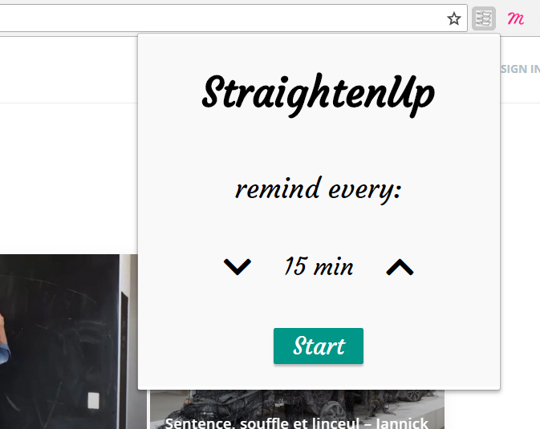
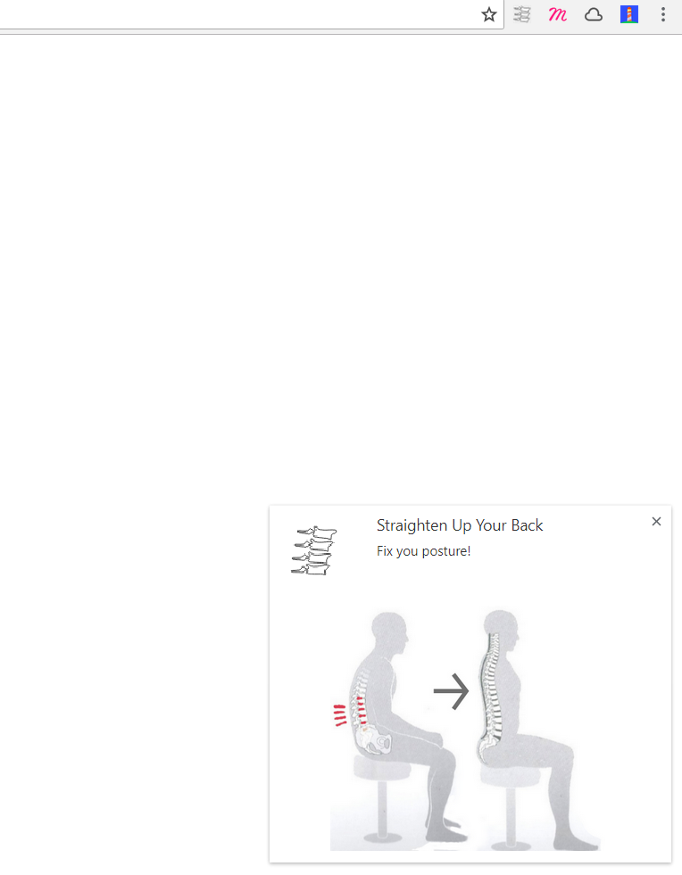
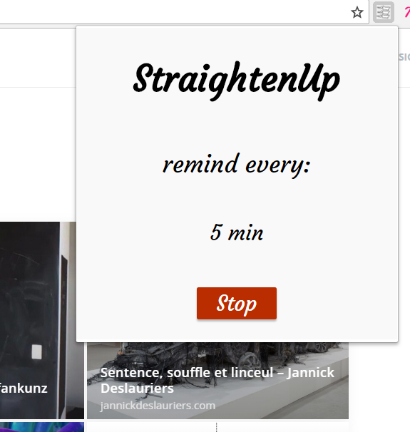

# StraigthenUp - Chrome Extension

Extension reminds user to correct posture in setup time interval.

## Technologies
* HTML
* CSS
* JavaScript

## Overwiev
* After installation open extension to set time interval
  

* Get notifications to correct your posture - build a healthy habbit
  

* Turn reminders off anytime you want
  